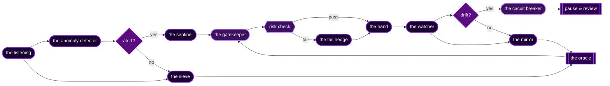

<p align="center">
  
</p>

<h1 align="center">✦   ✦   ✦</h1>

<p align="center">
  
</p>

<p align="center">
  
  
  
  
</p>

<p align="center"><sub>━━━━━━━━━━━━━━━━━━━━━━━━━━━━━━ ◆ ━━━━━━━━━━━━━━━━━━━━━━━━━━━━━━</sub></p>

### ✦ the terminal

<p align="center">
  
</p>

<p align="center"><i>the model sleeps when the market sleeps</i></p>

<p align="center"><sub>┄┄┄┄┄┄┄┄┄┄┄┄┄┄┄┄┄┄┄┄┄┄┄┄┄┄┄┄┄ ☽ ┄┄┄┄┄┄┄┄┄┄┄┄┄┄┄┄┄┄┄┄┄┄┄┄┄┄┄┄┄</sub></p>

### ✦ the agents are thinking

<p align="center">
  
</p>

<p align="center"><i>a partial list. the others have learned not to be observed.</i></p>

<p align="center"><sub>· ░░░░░░░░░░░░░░░░░░░░░░░░░░░ ⊹ ░░░░░░░░░░░░░░░░░░░░░░░░░░░ ·</sub></p>

### ✦ the workshop

> *some projects are louder when kept quiet.*

- 🤖 a machine that reads the tape so I don't have to
- 📡 it hasn't slept in months — it places its own bets
- 🧬 backtested across years, deployed in shadow
- 🜲 strategies, signals, edge — all classified
- 🜂 small daemons that whisper when the weather turns
- 🜄 a few things I'm not allowed to talk about yet

### ✦ live status

<p align="center">
  
  
  
  
  
</p>

<p align="center">
  
  
  
  
  
</p>

<p align="center">
  
  
  
  
  
</p>

<p align="center">
  
  
  
  
  
</p>

<p align="center"><sub>╌╌╌╌╌╌╌╌╌╌╌╌╌╌╌╌╌╌╌╌╌╌╌╌ ⊹ ╌╌╌╌╌╌╌╌╌╌╌╌╌╌╌╌╌╌╌╌╌╌╌╌</sub></p>

### ✦ the strategy deck

| codename | greek | edge | status |
|---|:---:|---|:---:|
| **NIGHTSHADE** | Δ | harvests volatility crush in earnings decay | `LIVE` |
| **OUROBOROS** | Γ | self-feeding loop: gamma scalp bleeds gamma | `EVOLVING` |
| **BLACKSTAR** | Θ | consumes dark pools when liquidity contracts | `DORMANT` |
| **KESTREL** | ρ | strikes correlation reversals at inflection | `LIVE` |
| **WRAITH** | Δ | feeds on bid-ask ghosts in circuit breaks | `REDACTED` |
| **CHARON** | Γ | extracts spread death from stale quotes | `ARCHIVED` |
| **OBSIDIAN** | Θ | vega long when fear hits peak momentum | `LIVE` |
| **VORTEX** | ν | spins vol-of-vol into mean reversion trades | `EVOLVING` |
| **RAVEN** | ρ | scavenges tail risk when crowding peaks | `LIVE` |
| **NEMESIS** | Δ | reverses momentum at predator-prey thresholds | `DORMANT` |
| **CRUCIBLE** | Γ | distills theta from the volatility furnace | `LIVE` |
| **LEVIATHAN** | Θ | hunts convexity in the deep smile abyss | `REDACTED` |

<p align="center"><sub>✦ ════════════════════════════════════════════════════════════ ✦</sub></p>

### ✦ the pipeline



<details>
<summary>📒 <b>session log</b> — open at your own risk</summary>

```text
| time         | op     | sym        | Δ      | qty    | pnl      | note           |
|--------------|--------|------------|--------|--------|----------|----------------|
| 09:15:32.145 | OPEN   | ████       | +0.32  | 250    | +1,240   | edge confirmed |
| 09:47:18.892 | HEDGE  | ██-██████  | -0.18  | -100   | ████     | weather shift  |
| 10:22:05.521 | ADJUST | ████████   | +0.45  | 150    | -380     | vol crush      |
| 10:58:41.334 | CLOSE  | ██-████    | -0.28  | -250   | +2,105   | reversion      |
| 11:33:09.776 | OPEN   | ████       | +0.16  | 400    | ████     | noise          |
| 12:11:47.003 | STOP   | ███████    | -0.52  | -200   | -1,650   | tail caught    |
| 12:45:22.418 | ROLL   | ██-██████  | +0.24  | 300    | +895     | █████          |
| 13:19:55.687 | ADJUST | ████████   | -0.31  | -150   | ████     | regime change  |
| 13:56:14.141 | CLOSE  | ████       | +0.41  | 200    | +3,420   | edge confirmed |
| 14:28:33.509 | HEDGE  | ██-████    | -0.19  | -100   | -245     | cool down      |
| 15:03:47.825 | OPEN   | ███████    | +0.38  | 350    | ████     | reversion      |
| 15:27:12.693 | CLOSE  | ██-██████  | -0.27  | -350   | +1,565   | noise          |
```

> session: ████  |  pnl: ████  |  sharpe: ████  |  ░░░░░░░░░ all classified ░░░░░░░░░

</details>

<p align="center"><sub>• ░░░░░░░░░░░░░░░░░░░░░░░░░░░░░░░░░░░░░░░░░░░░░░░░░░░░░ •</sub></p>

### ✦ rules of engagement

> *the desk has rules. they are not negotiable.*

```yaml
rule_001: never reveal the edge
rule_002: the model is right until proven wrong, twice
rule_003: every position has an exit; not every exit has a position
rule_004: hedge before you need to
rule_005: the market does not care about your conviction
rule_006: ████████████████████████████   # classified
rule_007: ████████████████████████████   # classified
rule_008: in case of doubt, smaller
rule_009: backtests lie loudly; live trades lie quietly
rule_010: silence compounds faster than capital
rule_011: ████████████████████████████   # eyes only
rule_∞:   the desk closes when the desk decides
```

### ✦ currently consulting

<p align="center">
  
  
  
  
  
</p>

### ✦ achievements

| sigil | name | when |
|:---:|---|:---:|
| 🜲 | first profitable backtest | _year of the wolf_ |
| 🜂 | first live deployment | _spring of the rooster_ |
| 🜁 | first model that disagreed with me (and was right) | _summer of the dragon_ |
| 🜄 | first 100% systematic week | _autumn of the snake_ |
| ✦ | first time the kill switch fired by itself | `███` |
| 𓂈 | first signal i didn't understand but trusted anyway | `███` |
| ☽ | first night i didn't watch the screen | `███` |
| ☾ | first time the desk made more than the trader | `███` |

### ✦ invocation

```python
# the daemon awakens at 09:14:00 IST
# it sleeps when the bell rings; it dreams in between
# do not interrupt it. it remembers.

from shadow_book   import Oracle, Gatekeeper, Hand, Mirror
from greeks        import Δ, Γ, Θ, ν, ρ
from regime        import detect, hedge, breathe

oracle = Oracle(model="█████", confidence=0.███)
gate   = Gatekeeper(max_drawdown=0.0███, kelly_cap=0.███)
hand   = Hand(broker="████████████", slippage=0.0███)
mirror = Mirror(reflects=True, lies=False)

while market.open:
    weather = detect.regime(market.tape)
    signal  = oracle.read(market.tape, weather)
    if gate.permits(signal, exposures=(Δ, Γ, Θ, ν, ρ)):
        hand.execute(signal)
        mirror.observe(signal)
    sleep(market.next_tick)

# the desk closes when the desk decides.
```

### ✦ the manifesto

> *six principles. all earned the hard way.*

1. **silence compounds** — every disclosed strategy decays toward parity
2. **risk is real, return is hope** — size the first, pray the second
3. **the model is the trader; you are the maintainer** — know the difference
4. **drawdown is tuition** — pay it or stop trading
5. **the market is a teacher who fails everyone eventually** — be early to the test
6. **all edge is conditional** — the regime that fed you will starve you

### ✦ the ledger

<table align="center">
<tr>
<td valign="top" width="50%">

**watching**

- ████ ▲▼ across 4 timeframes
- ███████ vol surface
- the gap between bid and intent
- the stories no one is telling
- the regime that has not arrived yet
- the model's second-guesses
- the silence between ticks

</td>
<td valign="top" width="50%">

**ignoring**

- crypto twitter
- youtube charlatans
- the news cycle
- backtests that look too good
- the loudest voice in the room
- anyone selling courses
- my own conviction

</td>
</tr>
</table>

### ✦ the library

> *what the desk reads when the market sleeps.*

| status | tome | author |
|:---:|---|---|
| `read · re-read · re-read` | _Options, Futures, and Other Derivatives_ | Hull |
| `read` | _Advances in Financial Machine Learning_ | López de Prado |
| `read` | _Trading and Exchanges_ | Harris |
| `studying` | _Volatility Trading_ | Sinclair |
| `studying` | _Active Portfolio Management_ | Grinold & Kahn |
| `archived` | _The Master and Margarita_ | Bulgakov |
| `dog-eared` | _Tao Te Ching_ | Lao Tzu |
| `███████` | `███████████████████████████` | `███████` |

### ✦ the todo

- [x] read the entire options pricing literature
- [x] backtest 7+ years of data
- [x] deploy live with real capital
- [x] survive the first regime change
- [x] build the kill switch (and trust it)
- [ ] survive the second regime change
- [ ] write the book ~~(no)~~
- [ ] retire (definition unclear)
- [ ] ████████████████████████
- [ ] ████████████████████████

<p align="center"><sub>┄ ☾ ┄┄┄┄┄┄┄┄┄┄┄┄┄┄┄┄┄┄┄┄┄┄┄┄┄┄┄┄┄┄┄┄┄┄┄┄┄┄┄┄┄┄┄┄┄┄┄┄┄┄┄ ☾ ┄</sub></p>

### ✦ tools of the trade

<p align="center">
  
</p>

<p align="center">
  
  
  
  
  
  
  
</p>

<p align="center"><sub>─ ☾ ─────────────────────────────────────────────────── ☾ ─</sub></p>

### ✦ the numbers

<p align="center">
  
</p>

<p align="center">
  
  
</p>

<p align="center">
  
  
</p>

<p align="center">
  
</p>

<p align="center">
  
</p>

<p align="center">
  
</p>

<p align="center"><sub>━━━━━━━━━━━━━━━━━━━━━━━━━━━━━━ ✦ ━━━━━━━━━━━━━━━━━━━━━━━━━━━━━━</sub></p>

### ✦ the void

<p align="center">
  
</p>

<details>
<summary>⚠️ <b>do not open</b></summary>

```
the pattern emerges only when you stop looking.
your edge is someone else's noise.
the market knows you're watching.
it always has.
```

</details>

<details>
<summary>🔮 <b>the prophecy</b></summary>

```
╔═══════════════════╗
║   THE MAGICIAN    ║
║  ─────────────    ║
║  ∴     ∴     ∴    ║
║ ∴   ○ ∴ ○   ∴     ║
║  ∴  ╱ ╲ ╱ ╲  ∴    ║
║   ∴ ╲___╱ ∴       ║
║      REVERSAL     ║
║   your profit is  ║
║    their exit     ║
╚═══════════════════╝
```

</details>

<details>
<summary>📊 <b>today's edge</b></summary>

<p align="center"><b>no.</b></p>

</details>

<details>
<summary>🤔 <b>are you sure</b></summary>

<details>
<summary>🤨 really sure</summary>

> the best strategy is the one you haven't told anyone about

<details>
<summary>😶 absolutely sure</summary>

> okay. but you didn't hear it from me.

</details>

</details>

</details>

<p align="center">
  <kbd>↑</kbd> <kbd>↑</kbd> <kbd>↓</kbd> <kbd>↓</kbd> <kbd>←</kbd> <kbd>→</kbd> <kbd>←</kbd> <kbd>→</kbd> <kbd>B</kbd> <kbd>A</kbd>
</p>

<!--
the model dreams in volatility.
backtests are fiction written by the past.
every trade is a conversation with chaos.
only the patient hear its answer.

if you are reading this, you are already inside.
welcome.
-->

---

<p align="center"><i>"if you tell them how it works, it stops working."</i></p>

<p align="center"><sub>[1] redacted internal memo · quant division · 2023 · classification: <b>EYES ONLY</b></sub></p>

<p align="center">
  
</p>

<p align="center"><sub><i>you scrolled all the way down. that means something.</i></sub></p>
