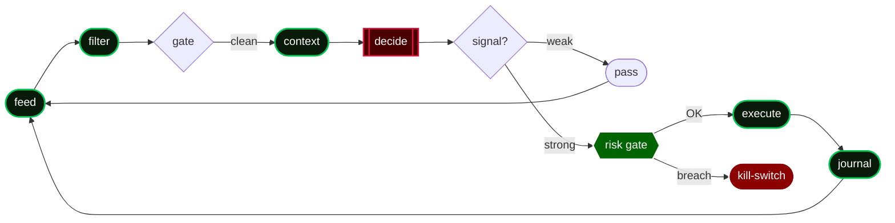

  

  

I'm a solo trader who builds small, AI-augmented trading systems that keep a human out of the daily
loop. I favor quiet, durable edges over loud ones. Still learning, still building in the open.

### The Trading Desks

| | Desk | Market | What it does |
|---|---|---|---|
| 🔴 | **Options Trading Desk** | NIFTY & SENSEX · F&O | Rules-based, no forecasting |
| 🟢 | **Crypto Trading Desk** | BTC & ETH · options | An LLM brain manages trades under hard caps |

Both run live on real capital, fully automated.

### The Loop

last update: 2026-07-02

