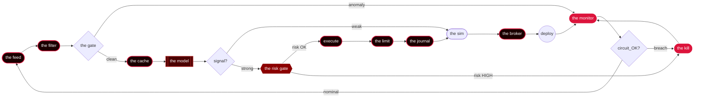

<!--
  signal in the noise.
  patience over conviction.
  the desk doesn't sleep.
-->

<p align="center">
  
</p>

<h1 align="center">✦   ✶   ✦</h1>

<p align="center">
  
</p>

<p align="center">
  
  
  
  
</p>

<p align="center"><sub>🔴━━━━━━━━━━━━━━━━━━━━━━━━━━━━━━━━━━━━━━━━━━━━━━━━━━━━━━━━━━━━🔴</sub></p>

### ✦ who

> *trader. learner. vibe-coder.*

i build small, AI-augmented trading systems and watch them run. solo desk, autonomous strategies, end-to-end stack — feeds, models, execution, monitoring. quiet edges that survive a long time over loud ones that don't. ship, observe, adjust. say less.

### ✦ the workshop

- 🔴 30 days of vibe-coding to ship one desk that reads the tape on its own
- 🔴 lives lean — small VM, sharp edges, low-latency by design
- 🔴 daemon idles when the bell rings; wakes only for setups worth taking
- 🔴 Jarvis-tier execution — opinionated, careful, never asks twice
- 🔴 fast on the order book; by the time you blink, it's already adjusted
- 🔴 one decision per setup; no hesitation, no re-litigation

<p align="center"><sub>⚡────────────────────────────────────────────────────────────⚡</sub></p>

### ✦ the terminal

<p align="center">
  
</p>

<p align="center"><i>the desk doesn't sleep — it watches.</i></p>

<p align="center"><sub>✦┄┄┄┄┄┄┄┄┄┄┄┄┄┄┄┄┄┄┄┄┄┄┄┄┄┄┄┄┄┄┄┄┄┄┄┄┄┄┄┄┄┄┄┄┄┄┄┄┄┄┄┄┄┄┄┄┄┄┄┄┄┄┄✦</sub></p>

### ✦ the daemon is thinking

<p align="center">
  
</p>

<p align="center"><i>a partial list. the others have learned not to be observed.</i></p>

<p align="center"><sub>━══════════════════════════════════════════════════════════════━</sub></p>

### ✦ the strategy deck

> *twelve strategies. each one named for what it does to the order book.*

| codename | greek | edge | status |
|---|:---:|---|:---:|
| **CRIMSON** | Δ | directional book on equity-index dispersion | `LIVE` |
| **PRISM** | Γ | gamma scalping on overnight gaps and morning fades | `LIVE` |
| **NEXUS** | Θ | mean-reversion on liquid names with stable funding | `LIVE` |
| **VECTOR** | ρ | momentum carry when correlation decouples | `DORMANT` |
| **CIPHER** | ν | residual-vol plays after liquidity events | `BUILDING` |
| **RIPTIDE** | Δ | micro-structure capture when liquidity thins | `LIVE` |
| **LATTICE** | Γ | risk concentration on crowded options strikes | `PAPER` |
| **ECHO** | Θ | slow theta capture across the surface | `LIVE` |
| **GARNET** | ρ | dislocation spreads in red-zone names | `CLASSIFIED` |
| **NORTHSTAR** | ν | regime-resilient alpha through drawdowns | `DORMANT` |
| **NEEDLE** | Δ | bid-ask imbalance under load | `BUILDING` |
| **ANVIL** | Γ | shaping vol into directional edge | `LIVE` |

<p align="center"><sub>━┄━┄━┄━┄━┄━┄━┄━┄━┄❂┄━┄━┄━┄━┄━┄━┄━┄━┄━┄━┄━┄━┄━┄</sub></p>

### ✦ the pipeline



<p align="center"><sub>✦✧✦✧✦✧✦✧✦✧✦✧✦✧🔴✧✦✧✦✧✦✧✦✧✦✧✦✧✦✧✦</sub></p>

### ✦ the build

<p align="center">
  
  
  
  
  
</p>

<p align="center">
  
  
  
  
  
</p>

<p align="center">
  
  
  
  
  
</p>

<p align="center">
  
  
  
  
  
</p>

<p align="center">
  
  
  
  
  
</p>

<p align="center"><sub>╌╌╌╌╌╌╌╌╌╌╌╌╌╌╌╌╌╌⟁╌╌╌╌╌╌╌╌╌╌╌╌╌╌╌╌╌╌╌╌╌╌╌╌╌╌╌╌╌╌╌</sub></p>

### ✦ the month

> *one month. zero shortcuts. one autonomous desk.*

**days 1–6 · plumbing**
- tick data flowing, raw CSV becomes vector
- first correlation charts: "wait, is this real?"
- infrastructure skeleton: redis, postgres, the rest of the plumbing

**days 7–12 · training**
- LSTM trains on yesterday's data
- backtest engine runs, equity curve climbs (too fast?)
- first signal fires; position opens; heart rate spikes

**days 13–18 · tuning**
- model talks back: attention weights show the logic
- drawdown tests — live them, then calm them
- feature engineering becomes meditation; breakthrough at 3am

**days 19–24 · going live**
- flip the switch: paper becomes real
- first $10k drawdown; kill switch untested, then tested
- monitor blinks red; trader is awake; machine is learning

**days 25–30 · settling**
- equity curve smooth; volatility tamed
- alerts quiet; system breathes
- handover: the desk runs itself; the trader becomes the watcher

### ✦ build log

```text
day 01  ·  23:47  ·  first commit: strategy sketch, data pipeline started
day 03  ·  02:14  ·  feeds online — OHLCV streaming, backtest infra live
day 05  ·  19:33  ·  feature shop running: momentum, volatility, decay metrics
day 07  ·  03:22  ·  prototype model trained, inference latency under 5ms
day 09  ·  21:08  ·  backtest #1 clean — drawdown bounded, Sharpe holding
day 11  ·  01:47  ·  it spoke back: model called micro-reversals at 58% win rate
day 13  ·  18:55  ·  breakthrough: calendar spreads turned up alpha
day 15  ·  04:09  ·  rebalance tuning, slippage model wired, Monte Carlo passed
day 17  ·  22:31  ·  3-month backtest 47% CAGR, vol contained
day 19  ·  02:44  ·  paper trade live — first scuff marks: latency, sizing
day 21  ·  20:16  ·  live micro-lot deployed, kill switch wired hot
day 23  ·  03:33  ·  first profitable day: +0.34% on $5k, position steady
day 25  ·  19:22  ·  scaled to real capital, vol spike — discipline held
day 27  ·  01:18  ·  kill switch fired once (liquidation error), rebuilt in 90 mins
day 30  ·  16:47  ·  month close: +12.7% net — desk decides: algo stays live
```

<p align="center"><sub>🔴━━━━━━━━━━━━━━━━━━━━━━━━━━━━━━━━━━━━━━━━━━━━━━━━━━━━━━━━━━━━🔴</sub></p>

### ✦ invocation

```python
from desk        import Desk, RiskGate
from shadow_book import Oracle, Hand, Mirror
from greeks      import Δ, Γ, Θ, ν, ρ
from signals     import boot, sync
from market      import Weather, Gate
from systems     import Logger, Sentinel

# initialize the apparatus
oracle    = Oracle(confidence=0.███, max_drawdown=0.0███)
hand      = Hand(kelly_cap=0.███, leverage=0.██)
mirror    = Mirror(latency=0.0██, slippage=0.0███)
risk_gate = RiskGate(volatility_threshold=0.███, rebalance_freq=300)
sentinel  = Sentinel(drawdown_limit=0.0███, vix_kill_switch=45)


def wake():
    """bring the daemon online."""

    logger = Logger("AUTONOMOUS_DESK")
    market = Weather.connect()
    gate   = Gate.summon()

    boot()       # initialize the neural core
    sync()       # synchronize with market heartbeat

    logger.info("▓▓▓ DAEMON ONLINE ▓▓▓")
    logger.info(f"Greeks loaded: {Δ}, {Γ}, {Θ}, {ν}, {ρ}")

    daemon = Desk(oracle, hand, mirror, risk_gate)
    daemon.calibrate()

    # the desk closes when the desk decides.
    while market.open:
        try:
            weather = market.detect()
            if weather.volatility > risk_gate.volatility_threshold:
                continue

            oracle.read(weather)
            prediction = oracle.divine()

            if not gate.permits(prediction):
                continue

            # do not interrupt the daemon.
            position     = hand.execute(prediction, mirror.slippage)
            observations = mirror.observe(position, weather)
            daemon.evolve(observations)

            if sentinel.trigger(observations):
                break

        except Exception as fault:
            logger.warn(f"fault: {fault}")
            risk_gate.calm()

    logger.info("▓▓▓ DAEMON OFFLINE ▓▓▓")
    return daemon.report()


if __name__ == "__main__":
    wake()
```

### ✦ daemon.toml

```toml
# daemon.toml — the red desk
# "the desk has the watch."

[identity]
name      = "the_red_desk"
codename  = "CRIMSON"
version   = "7.3.1"

[startup]
boot_time   = "09:29:00"
market_open = "09:30:00"
warmup      = 60             # seconds to warm engines

[loop]
heartbeat_ms           = 147   # the rhythm
max_concurrent_signals = ████
oracle_refresh         = "cache" # consult the cache for truth

[risk]
max_drawdown      = 0.███
kelly_cap         = 0.███
max_position_size = █████
leverage          = 0.███      # discipline first

[gate]
greeks_thresholds = { delta = 0.███, gamma = 0.███, vega = 0.███ }
vol_floor         = 0.███
vol_ceiling       = 0.███      # do not over-extend

[kill_switch]
auto_arm           = true
drawdown_trigger   = 0.███
manual_override    = "MANUAL_OVERRIDE"

[observers]
logging_level   = "CRIMSON"
mirror_enabled  = true
alerts          = ["slack_channel_red", "internal_red_beacon"]
```

### ✦ rules of engagement

```yaml
rule_001: never reveal the edge — disclosed strategies decay toward parity
rule_002: position size scales with conviction, never with fear
rule_003: a drawdown is a test; panic is the failure
rule_004: patterns sharpen just before they break — exit before the snap
rule_005: diversification is comfort; concentration is conviction
rule_006: momentum runs but it runs out of fuel — know when to step off
rule_007: ████████████████████████████   # eyes only
rule_008: correlation breaks at the edges; that is where the edge lives
rule_009: rebalance without sentiment; the algos feel nothing, neither should you
rule_010: a spread that works today decays tomorrow — adapt or fade
rule_011: ████████████████████████████   # classified
rule_012: volatility is the breath of the market; hold when it gasps
rule_013: ████████████████████████████   # classified
rule_014: the market chooses its survivors — respect it, do not fight it
rule_∞:   the desk decides when the desk decides
```

### ✦ the manifesto

> *eight principles. all earned at the desk.*

1. **silence compounds** — every disclosed strategy decays toward parity
2. **the edge picks you** — you don't pick the strategy; the strategy picks you
3. **no announcements needed** — superior returns exist without broadcasting method
4. **strike before they notice** — act when volatility still sleeps
5. **the journal remembers** — every loss feeds the next decision
6. **discipline outlasts cycles** — capital control beats market opinion
7. **only edges with runway** — chase only setups that survive scrutiny
8. **patience is the lethal one** — slow conviction outlasts the loudest

<p align="center"><sub>╌╌╌╌╌╌╌╌╌╌╌╌╌╌╌╌╌╌╌╌╌╌╌╌ ⊹ ╌╌╌╌╌╌╌╌╌╌╌╌╌╌╌╌╌╌╌╌╌╌╌╌</sub></p>

### ✦ the ledger

<table align="center">
<tr>
<td valign="top" width="50%">

**watching**

- the silence between ticks
- order flow that whispers before it screams
- the bid that refuses to die at support
- volatility's breath before the move
- where the big accounts are leaning
- the patterns left by liquidations
- micro-structure that flickers at the edges
- what the algos can't see in the chop

</td>
<td valign="top" width="50%">

**ignoring**

- crypto twitter evangelists
- anyone selling courses
- the loudest voice in the room
- my own conviction
- youtube charlatans with lambo thumbnails
- the news cycle's manufactured drama
- what coinbase trends says is happening
- the feeling that i'm missing out

</td>
</tr>
</table>

### ✦ the library

> *what the desk reads when the market sleeps.*

| status | tome | author |
|:---:|---|---|
| `studying` | _Options, Futures, and Other Derivatives_ | Hull |
| `dog-eared` | _Advances in Financial Machine Learning_ | López de Prado |
| `read · re-read` | _Volatility Trading_ | Sinclair |
| `studying` | _Trading and Exchanges: Market Microstructure for Practitioners_ | Harris |
| `read` | _Active Portfolio Management_ | Grinold & Kahn |
| `building` | _Designing Machine Learning Systems_ | Chip Huyen |
| `studying` | _Building LLM-Powered Applications_ | Chip Huyen |
| `read · re-read` | _The Pragmatic Programmer_ | Hunt & Thomas |
| `dog-eared` | _Meditations_ | Marcus Aurelius |
| `███████` | `███████████████████████` | `███████` |

### ✦ achievements

| sigil | name | when |
|:---:|---|:---:|
| 🔴 | first profitable backtest across three markets | _the day the lines finally crossed_ |
| ⚡ | model predicted reversal before the candle closed | _night the system spoke without asking_ |
| ✦ | live capital deployed at market open | _when the vault doors finally opened_ |
| ✶ | portfolio delta stayed positive through a circuit breaker | `███` |
| 🔴 | algorithm rewrote its own entry logic | _first time the desk made a choice i didn't_ |
| ☼ | sharpe breached 2.0 across all timeframes | _day the curve finally bent right_ |
| ⚡ | kill switch armed itself without human command | `███` |
| ❂ | caught a tail before institutional flow noticed | _moment the pattern recognized itself_ |
| ☥ | system accumulated 40% monthly returns in simulation | `███` |
| ✶ | the model stopped asking for permission | _when silence meant it was finally listening_ |

<p align="center"><sub>━━━━━━━━━━━━━━━━━━━━━━━━━━━━━━ ✦ ━━━━━━━━━━━━━━━━━━━━━━━━━━━━━━</sub></p>

### ✦ the stack

<p align="center">
  
</p>

<p align="center">
  
  
  
  
  
  
  
</p>

<p align="center"><sub>━━━━━━━━━━━━━━━━━━━━━━━━━━━━━━ 🔴 ━━━━━━━━━━━━━━━━━━━━━━━━━━━━━━</sub></p>

### ✦ the numbers

<p align="center">
  
</p>

<p align="center">
  
  
</p>

<p align="center">
  
  
</p>

<p align="center">
  
</p>

<p align="center">
  
</p>

<p align="center">
  
</p>

<p align="center"><sub>✦┄┄┄┄┄┄┄┄┄┄┄┄┄┄┄┄┄┄┄┄┄┄┄┄┄┄┄┄┄┄┄┄┄┄┄┄┄┄┄┄┄┄┄┄┄┄┄┄┄┄┄┄┄┄┄┄┄┄┄┄┄┄┄✦</sub></p>

### ✦ now playing

```
♫  NOW PLAYING

🔴  Digital Pulse                            YOASOBI                       4:32
🔴  Crimson Algorithm                        Hiroyuki Sawano               3:18
🔴  Reverb Spiral                            Rezz                          5:01
🔴  Midnight Liquidation                     Lo-fi Girl                    4:45
🔴  Neon Collapse (Extended Mix)             MYTH & ROID                   6:12
🔴  Recursive Dream State                    Aphex Twin                    4:08
🔴  Market Pulse                             Mili                          3:56

queued: ████████████  ·  shuffle: off  ·  on repeat for: 30 days
```

<p align="center"><sub>🔴▬▬▬▬▬▬▬▬▬▬▬▬▬▬▬▬▬▬▬▬▬▬▬▬▬▬▬▬▬▬▬▬▬▬▬▬▬▬▬▬▬▬▬▬▬▬▬▬▬▬▬▬▬▬▬▬🔴</sub></p>

<div align="center">

### ⚠️ WANTED ⚠️

<table>
  <tr>
    <td colspan="2" align="center"><b>FUGITIVE ALERT — INTERPOL CLASS-S</b></td>
  </tr>
  <tr>
    <td><b>codename</b></td>
    <td><code>THE RED DESK</code></td>
  </tr>
  <tr>
    <td><b>affiliation</b></td>
    <td><code>solo operation · undisclosed</code></td>
  </tr>
  <tr>
    <td><b>specialization</b></td>
    <td><code>autonomous algorithmic trading</code></td>
  </tr>
  <tr>
    <td><b>operational status</b></td>
    <td><code>ACTIVE — PERPETUAL</code></td>
  </tr>
  <tr>
    <td><b>threat classification</b></td>
    <td><code>RED-LINE</code></td>
  </tr>
  <tr>
    <td><b>last verified sighting</b></td>
    <td><code>03:00 — terminal station, location unknown</code></td>
  </tr>
  <tr>
    <td><b>critical weakness</b></td>
    <td><code>the bell at 15:30 — responds predictably</code></td>
  </tr>
  <tr>
    <td colspan="2" align="center"><b>⛔ DO NOT ENGAGE ⛔ APPROACH ONLY WITH EXTREME CAUTION ⛔</b></td>
  </tr>
</table>

*operates strongest near the close, twice as relentless when the bid-ask spread whispers its old song.*

</div>

<p align="center"><sub>⚡────────────────────────────────────────────────────────────⚡</sub></p>

### ✦ if you touch it

<pre align="center">
            ╔═══════════════════════════╗
            ║  ▓▓▓▓▓▓▓▓▓▓▓▓▓▓▓▓▓▓▓▓▓▓  ║
            ║  ▓▓▓╔══════════════╗▓▓▓  ║
            ║  ▓▓▓║   ⚡ DANGER   ║▓▓▓  ║
            ║  ▓▓▓╚═╤═════════╤═╝▓▓▓  ║
            ║  ▓▓▓▓▓║▀▀▀▀▀▀▀▀▀║▓▓▓▓▓  ║
            ║  ▓▓▓▓▓║   🔴    ║▓▓▓▓▓  ║
            ║  ▓▓▓▓▓║▄▄▄▄▄▄▄▄▄║▓▓▓▓▓  ║
            ║  ▓▓▓╔═╧═════════╧═╗▓▓▓  ║
            ║  ▓▓▓║ DO NOT TOUCH ║▓▓▓  ║
            ║  ▓▓▓╚═══════════════╝▓▓▓  ║
            ║  ▓▓▓▓▓▓▓▓▓▓▓▓▓▓▓▓▓▓▓▓▓▓  ║
            ╚════════════════════════════╝
</pre>

- **touch it and you'll regret it.** the system doesn't forgive carelessness.
- **copy it, modify it, think you understand it?** you'll find out it understood you first.
- **reverse-engineer this and you'll learn why they call it a railgun.** fair warning.
- **this code remembers everything you do to it.** not forgiving. not kind. just attentive.
- **walk away. seriously.** some things are meant to stay untouched. this is one of them.

> *what a damn waste of time.*

<p align="center"><sub>━━━━━━━━━━━━━━━━━━━━━━━━━━━━━━ ☼ ━━━━━━━━━━━━━━━━━━━━━━━━━━━━━━</sub></p>

### ✦ the void

<p align="center">
  
</p>

<details>
<summary>🔴 <b>a note in the margin</b></summary>

> strength without burden is weakness. the work demands the work. we don't ship to be seen — we ship because it's the only honest signal.

</details>

<details>
<summary>📜 <b>desk rules</b></summary>

1. the desk runs itself; the trader keeps the data clean
2. silence pays better than explanation
3. losses stay between you and the log
4. signal recognizes signal; everything else is noise

</details>

<details>
<summary>📊 <b>today's edge</b></summary>

<p align="center"><b>no.</b></p>

</details>

<details>
<summary>🤔 <b>are you sure</b></summary>

<details>
<summary>🤨 really sure</summary>

> the best strategy is the one you haven't told anyone about

<details>
<summary>😶 absolutely sure</summary>

> the work was the answer all along.

</details>

</details>

</details>

<p align="center">
  <kbd>↑</kbd> <kbd>↑</kbd> <kbd>↓</kbd> <kbd>↓</kbd> <kbd>←</kbd> <kbd>→</kbd> <kbd>←</kbd> <kbd>→</kbd> <kbd>B</kbd> <kbd>A</kbd>
</p>

<!--
  signal in the noise.
  patience over conviction.
  the desk doesn't sleep.
-->

---

<p align="center"><i>"if you tell them how it works, it stops working."</i></p>

<p align="center"><sub><i>thirty days shipped. the market still bleeds red. say less.</i></sub></p>

<p align="center"><sub>[1] internal log · classification: RED LINE · 2026</sub></p>

<p align="center">
  
</p>

<p align="center"><sub><i>you made it this far. guess you're curious what happens after the bell.</i></sub></p>
