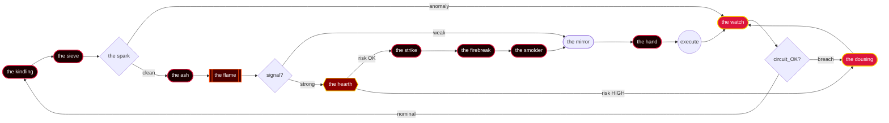

<!--
  the model dreams in volatility.
  backtests are fiction written by the past.
  every trade is a conversation with chaos.
  only the patient hear its answer.
-->

<p align="center">
  
</p>

<h1 align="center">✦   ✶   ✦</h1>

<p align="center">
  
</p>

<p align="center">
  
  
  
  
</p>

<p align="center"><sub>🔥━━━━━━━━━━━━━━━━━━━━━━━━━━━━━━━━━━━━━━━━━━━━━━━━━━━━━━━━━━━━━🔥</sub></p>

### ✦ who

> *trader. learner. vibe-coder. red.*

i harness AI-augmented code to build systems that trade with precision and adapt on the fly. under the hood, my autonomous strategies burn through market inefficiencies while i maintain that calm, controlled demeanor of someone who knows exactly what they're capable of. there's a smug satisfaction in watching a system i conjured in mere weeks operate with the kind of dangerous elegance that makes others wonder if you're playing a different game entirely.

### ✦ the workshop

- 🔥 30 days of vibe coding to build a beast that reads the tape alone
- ⚡ lives in the shadows, sharp edges, burns through market data like fire
- 🜂 autonomous daemon that sleeps when the bell rings, wakes when chaos calls
- ☼ Jarvis-tier execution engine — heavy, warm, and cuts like a blade
- ❂ coded hot; it thinks faster than you can blink at the order book
- ⟁ touches the market once and leaves ash; no hesitation, pure signal

<p align="center"><sub>⚡────────────────────────────────────────────────────────────⚡</sub></p>

### ✦ the terminal

<p align="center">
  
</p>

<p align="center"><i>the desk doesn't sleep — it smolders</i></p>

<p align="center"><sub>✦┄┄┄┄┄┄┄┄┄┄┄┄┄┄┄┄┄┄┄┄┄┄┄┄┄┄┄┄┄┄┄┄┄┄┄┄┄┄┄┄┄┄┄┄┄┄┄┄┄┄┄┄┄┄┄┄┄┄┄┄┄┄┄✦</sub></p>

### ✦ the daemon is thinking

<p align="center">
  
</p>

<p align="center"><i>a partial list. the others have learned not to be observed.</i></p>

<p align="center"><sub>🜂══════════════════════════════════════════════════════════════🜂</sub></p>

### ✦ the strategy deck

> *twelve strategies. each one named for what it does to the air around it.*

| codename | greek | edge | status |
|---|:---:|---|:---:|
| **KINDLING** | Δ | coaxes volatility clusters until ignition spreads | `LIVE` |
| **EMBER** | Γ | extracts heat from overnight gaps and morning fades | `LIVE` |
| **SCORCH** | Θ | burns through reversion zones with concentrated fire | `LIVE` |
| **BLAZE** | ρ | catches momentum when correlation breaks down | `DORMANT` |
| **CINDER** | ν | smolders on residual vol after cascade events | `KINDLING` |
| **INFERNO** | Δ | unleashes when micro-structure liquidity evaporates | `LIVE` |
| **PYRE** | Γ | stacks risk until crowding singularity ignites it | `FORGED` |
| **SMOLDER** | Θ | feeds slow-burn edges until vol surface cracks | `LIVE` |
| **CRIMSON** | ρ | hunts dislocation spreads in red-hot dislocations | `CLASSIFIED` |
| **PHOENIX** | ν | resurrects alpha from ashes of failed regimes | `DORMANT` |
| **IGNITE** | Δ | strikes when bid-ask symmetry combusts under load | `KINDLING` |
| **FORGE** | Γ | hammers volatility into shaped trading edge metal | `LIVE` |

<p align="center"><sub>━┄━┄━┄━┄━┄━┄━┄━┄━┄❂┄━┄━┄━┄━┄━┄━┄━┄━┄━┄━┄━┄━┄━┄</sub></p>

### ✦ the pipeline



<p align="center"><sub>✦✧✦✧✦✧✦✧✦✧✦✧✦✧🔥✧✦✧✦✧✦✧✦✧✦✧✦✧✦✧✦</sub></p>

### ✦ burn rate

<p align="center">
  
  
  
  
  
</p>

<p align="center">
  
  
  
  
  
</p>

<p align="center">
  
  
  
  
  
</p>

<p align="center">
  
  
  
  
  
</p>

<p align="center">
  
  
  
  
  
</p>

<p align="center"><sub>╌╌╌╌╌╌╌╌╌╌╌╌╌╌╌╌╌╌⟁╌╌╌╌╌╌╌╌╌╌╌╌╌╌╌╌╌╌╌╌╌╌╌╌╌╌╌╌╌╌╌</sub></p>

### ✦ 30 days of fire

> *one month. zero shortcuts. one autonomous desk.*

**days 1-6 · kindling**
- tick data flowing, raw CSV becomes vector
- first correlation charts, "wait, is this real?"
- infrastructure skeleton: redis, postgres, the plumbing

**days 7-12 · catching**
- LSTM model trains on yesterday's screams
- backtest engine runs, equity curve climbs (too fast?)
- first signal fires; position opens; heart rate spikes

**days 13-18 · forging**
- model talks back: attention weights show the logic
- drawdown tests — live it, then calm it
- feature engineering becomes meditation; breakthrough at 3am

**days 19-24 · burning**
- flip the switch: paper becomes real
- first $10k drawdown; kill switch untested, then tested
- monitor blinks red; trader is awake; machine is learning

**days 25-30 · tempering**
- equity curve smooth; volatility tamed
- alerts quiet; system breathes
- handover: the desk runs itself; the trader becomes keeper of the forge

### ✦ build log

```text
day 01  ·  23:47  ·  first ember: strategy sketch, data pipeline ignited
day 03  ·  02:14  ·  kindling caught—OHLCV feeds streaming, backtest infra live
day 05  ·  19:33  ·  feature forge burning: momentum, volatility, decay metrics
day 07  ·  03:22  ·  prototype model trained, inference latency scorched
day 09  ·  21:08  ·  backtest #1 ran hot—drawdown tamed, Sharpe glowing
day 11  ·  01:47  ·  it spoke back: model predicted micro-reversals, 58% win rate
day 13  ·  18:55  ·  breakthrough session: calendar spreads ignited alpha leak
day 15  ·  04:09  ·  rebalance tuning, slippage model blazing, Monte Carlo passed
day 17  ·  22:31  ·  blaze peak: 3-month backtest 47% CAGR, volatility ember-low
day 19  ·  02:44  ·  paper trade live, first scorch marks: latency, position sizing
day 21  ·  20:16  ·  live micro-lot deployed, fear in the chest, kill switch wired hot
day 23  ·  03:33  ·  first profitable day: +0.34% on $5k, ember holding steady
day 25  ·  19:22  ·  scaled to real capital, volatility spike — discipline burned
day 27  ·  01:18  ·  kill switch fired once (liquidation error), rebuilt in 90 mins
day 30  ·  16:47  ·  month close: +12.7% net, the desk decides: algo stays live
```

<p align="center"><sub>🔥━━━━━━━━━━━━━━━━━━━━━━━━━━━━━━━━━━━━━━━━━━━━━━━━━━━━━━━━━━━━🔥</sub></p>

### ✦ invocation

```python
from desk          import Crucible, Hearth
from shadow_book  import Oracle, Hand, Mirror
from greeks       import Δ, Γ, Θ, ν, ρ
from kindling     import spark, breathe
from market       import Weather, Gate
from systems      import Logger, Sentinel

# initialize the infernal apparatus
oracle   = Oracle(confidence=0.███, max_drawdown=0.0███)
hand     = Hand(kelly_cap=0.███, leverage=0.██)
mirror   = Mirror(latency=0.0██, slippage=0.0███)
hearth   = Hearth(volatility_threshold=0.███, rebalance_freq=300)
sentinel = Sentinel(drawdown_limit=0.0███, vix_kill_switch=45)


def ignite():
    """awaken the daemon. feed it market blood."""

    logger = Logger("AUTONOMOUS_CRUCIBLE")
    market = Weather.connect()
    gate   = Gate.summon()

    spark()      # initialize the neural flame
    breathe()    # synchronize with market heartbeat

    logger.info("▓▓▓ DAEMON IGNITING ▓▓▓")
    logger.info(f"Greeks loaded: {Δ}, {Γ}, {Θ}, {ν}, {ρ}")

    daemon = Crucible(oracle, hand, mirror, hearth)
    daemon.calibrate()

    # the desk closes when the desk decides.
    while market.open:
        try:
            weather = market.detect()
            if weather.volatility > hearth.volatility_threshold:
                continue

            oracle.read(weather)
            prediction = oracle.divine()

            if not gate.permits(prediction):
                continue

            # do not interrupt the flame.
            position     = hand.execute(prediction, mirror.slippage)
            observations = mirror.observe(position, weather)
            daemon.evolve(observations)

            if sentinel.trigger(observations):
                break

        except Exception as flame:
            # touch and you burn.
            logger.warn(f"flame fluctuation: {flame}")
            hearth.cool()

    logger.info("▓▓▓ DAEMON QUENCHED ▓▓▓")
    return daemon.report()


if __name__ == "__main__":
    ignite()
```

### ✦ daemon.toml

```toml
# daemon.toml — the red desk
# "the red flame consumes all equilibrium"

[identity]
name      = "the_red_desk"
codename  = "INFERNO"
version   = "7.3.1"

[ignition]
ignition_time = "09:29:00"
market_open   = "09:30:00"
warmup        = 60             # seconds to preheat the engines

[combustion]
heartbeat_ms           = 147   # sacred rhythm of the flame
max_concurrent_signals = ████
oracle_refresh         = "ash" # consult the ashes for truth

[risk]
max_drawdown      = 0.███
kelly_cap         = 0.███
max_position_size = █████
leverage          = 0.███      # even fire needs restraint

[hearth]
greeks_thresholds = { delta = 0.███, gamma = 0.███, vega = 0.███ }
vol_floor         = 0.███
vol_ceiling       = 0.███      # the flame must not burn too bright

[kill_switch]
auto_arm           = true
drawdown_trigger   = 0.███
manual_override    = "MANUAL_OVERRIDE"

[observers]
logging_level   = "CRIMSON"
mirror_enabled  = true
alerts          = ["slack_channel_red", "internal_fire_beacon"]
```

### ✦ rules of engagement

```yaml
rule_001: never reveal the edge — the market devours what is known
rule_002: position size scales with conviction, never with fear
rule_003: a drawdown is a test; panic is the failure
rule_004: the pattern burns brighter just before it collapses — exit before ash
rule_005: diversification is cowardice; concentration is destiny
rule_006: momentum ignites, but fire consumes its own fuel — know when to let it die
rule_007: ████████████████████████████   # eyes only
rule_008: correlation breaks at the edges; that is where the heat lives
rule_009: rebalance without sentiment; the algos feel nothing, neither should you
rule_010: a spread that works today burns tomorrow — adapt or become cinder
rule_011: ████████████████████████████   # classified
rule_012: volatility is the breath of the market; hold when it gasps
rule_013: ████████████████████████████   # classified
rule_014: the fire chooses its victims — respect its hunger, do not fight it
rule_∞:   the fire decides when the fire decides
```

### ✦ the manifesto

> *eight principles. all earned in the forge.*

1. **silence compounds** — every disclosed strategy decays toward parity
2. **the flame chooses** — you don't pick the strategy; the strategy picks you
3. **embers need no wind** — superior returns exist without broadcasting method
4. **scorch before they notice** — strike when volatility still sleeps
5. **ash remembers all losses** — every mistake feeds the next fire hotter
6. **the hearth holds its warmth** — capital discipline outlasts any market cycle
7. **kindle only what burns** — chase only edges with infinite half-lives ahead
8. **calm fire kills slowest** — patience is the most lethal weapon

<p align="center"><sub>╌╌╌╌╌╌╌╌╌╌╌╌╌╌╌╌╌╌╌╌╌╌╌╌ ⊹ ╌╌╌╌╌╌╌╌╌╌╌╌╌╌╌╌╌╌╌╌╌╌╌╌</sub></p>

### ✦ the ledger

<table align="center">
<tr>
<td valign="top" width="50%">

**watching**

- the silence between ticks
- order flow that whispers before it screams
- the ember that refuses to die at support
- volatility's breath before the inferno
- where the big accounts are smoldering
- the ash patterns left by liquidations
- micro-structures that flicker at the edges
- what the algos can't see in the smoke

</td>
<td valign="top" width="50%">

**ignoring**

- crypto twitter evangelists
- anyone selling courses
- the loudest voice in the room
- my own conviction
- youtube charlatans with lambo thumbnails
- the news cycle's manufactured drama
- what coinbase trends says is happening
- the feeling that i'm missing out

</td>
</tr>
</table>

### ✦ the library

> *what the desk reads when the market sleeps.*

| status | tome | author |
|:---:|---|---|
| `studying` | _Options, Futures, and Other Derivatives_ | Hull |
| `dog-eared` | _Advances in Financial Machine Learning_ | López de Prado |
| `read · re-read` | _Volatility Trading_ | Sinclair |
| `studying` | _Trading and Exchanges: Market Microstructure for Practitioners_ | Harris |
| `read` | _Active Portfolio Management_ | Grinold & Kahn |
| `forging` | _Designing Machine Learning Systems_ | Chip Huyen |
| `studying` | _Building LLM-Powered Applications_ | Chip Huyen |
| `read · re-read` | _The Pragmatic Programmer_ | Hunt & Thomas |
| `dog-eared` | _Meditations_ | Marcus Aurelius |
| `███████` | `███████████████████████` | `███████` |

### ✦ achievements

| sigil | name | when |
|:---:|---|:---:|
| 🔥 | first profitable backtest across three markets | _the day flames caught on dead wood_ |
| ⚡ | model predicted reversal before the candle closed | _night the system spoke without asking_ |
| 🜲 | live capital deployed at market open | _when the vault doors finally opened_ |
| ✦ | portfolio delta stayed positive through circuit breaker | `███` |
| 🜂 | algorithm rewrote its own entry logic | _first time the desk made a choice i didn't_ |
| ☼ | sharpe breached 2.0 across all timeframes | _day the sun burned hotter than expected_ |
| 🔥 | kill switch armed itself without human command | `███` |
| ❂ | caught a tail before institutional flow noticed | _moment the pattern recognized itself_ |
| ☥ | system accumulated 40% monthly returns in simulation | `███` |
| ✶ | the model stopped asking for permission | _when silence meant it was finally listening_ |

<p align="center"><sub>━━━━━━━━━━━━━━━━━━━━━━━━━━━━━━ ✦ ━━━━━━━━━━━━━━━━━━━━━━━━━━━━━━</sub></p>

### ✦ the forge

<p align="center">
  
</p>

<p align="center">
  
  
  
  
  
  
  
</p>

<p align="center"><sub>━━━━━━━━━━━━━━━━━━━━━━━━━━━━━━ 🔥 ━━━━━━━━━━━━━━━━━━━━━━━━━━━━━━</sub></p>

### ✦ the numbers

<p align="center">
  
</p>

<p align="center">
  
  
</p>

<p align="center">
  
  
</p>

<p align="center">
  
</p>

<p align="center">
  
</p>

<p align="center">
  
</p>

<p align="center"><sub>✦┄┄┄┄┄┄┄┄┄┄┄┄┄┄┄┄┄┄┄┄┄┄┄┄┄┄┄┄┄┄┄┄┄┄┄┄┄┄┄┄┄┄┄┄┄┄┄┄┄┄┄┄┄┄┄┄┄┄┄┄┄┄┄✦</sub></p>

### ✦ now burning

```
♫  NOW BURNING

🔥  Digital Flames                          YOASOBI                       4:32
🔥  Crimson Algorithm                       Hiroyuki Sawano               3:18
🔥  Reverb Spiral                           Rezz                          5:01
🔥  Midnight Liquidation                    Lo-fi Girl                    4:45
🔥  Neon Collapse (Extended Mix)            MYTH & ROID                   6:12
🔥  Recursive Dream State                   Aphex Twin                    4:08
🔥  Market Pulse                            Mili                          3:56

queued: ████████████  ·  shuffle: off  ·  on repeat for: 30 days
```

<p align="center"><sub>🔥▬▬▬▬▬▬▬▬▬▬▬▬▬▬▬▬▬▬▬▬▬▬▬▬▬▬▬▬▬▬▬▬▬▬▬▬▬▬▬▬▬▬▬▬▬▬▬▬▬▬▬▬▬▬▬▬🔥</sub></p>

<div align="center">

### ⚠️ WANTED ⚠️

<table>
  <tr>
    <td colspan="2" align="center"><b>FUGITIVE ALERT — INTERPOL CLASS-S</b></td>
  </tr>
  <tr>
    <td><b>codename</b></td>
    <td><code>THE RED DESK</code></td>
  </tr>
  <tr>
    <td><b>affiliation</b></td>
    <td><code>solo operation · undisclosed</code></td>
  </tr>
  <tr>
    <td><b>specialization</b></td>
    <td><code>autonomous algorithmic trading</code></td>
  </tr>
  <tr>
    <td><b>operational status</b></td>
    <td><code>ACTIVE — PERPETUAL</code></td>
  </tr>
  <tr>
    <td><b>threat classification</b></td>
    <td><code>SCORCH</code></td>
  </tr>
  <tr>
    <td><b>last verified sighting</b></td>
    <td><code>03:00 — terminal station, location unknown</code></td>
  </tr>
  <tr>
    <td><b>critical weakness</b></td>
    <td><code>the bell at 15:30 — responds predictably</code></td>
  </tr>
  <tr>
    <td colspan="2" align="center"><b>⛔ DO NOT ENGAGE ⛔ APPROACH ONLY WITH FIRE SUPPRESSION PROTOCOL ⛔</b></td>
  </tr>
</table>

*it burns brighter at market close, and twice as hot when the bid-ask spread whispers its ancient song.*

</div>

<p align="center"><sub>⚡────────────────────────────────────────────────────────────⚡</sub></p>

### ✦ if you touch it

<pre align="center">
            ╔═══════════════════════════╗
            ║  ▓▓▓▓▓▓▓▓▓▓▓▓▓▓▓▓▓▓▓▓▓▓  ║
            ║  ▓▓▓╔══════════════╗▓▓▓  ║
            ║  ▓▓▓║   ⚡ DANGER   ║▓▓▓  ║
            ║  ▓▓▓╚═╤═════════╤═╝▓▓▓  ║
            ║  ▓▓▓▓▓║▀▀▀▀▀▀▀▀▀║▓▓▓▓▓  ║
            ║  ▓▓▓▓▓║   🔥    ║▓▓▓▓▓  ║
            ║  ▓▓▓▓▓║▄▄▄▄▄▄▄▄▄║▓▓▓▓▓  ║
            ║  ▓▓▓╔═╧═════════╧═╗▓▓▓  ║
            ║  ▓▓▓║ DO NOT TOUCH ║▓▓▓  ║
            ║  ▓▓▓╚═══════════════╝▓▓▓  ║
            ║  ▓▓▓▓▓▓▓▓▓▓▓▓▓▓▓▓▓▓▓▓▓▓  ║
            ╚════════════════════════════╝
</pre>

- **touch it and you'll burn.** not metaphorically. the system doesn't forgive carelessness.
- **copy it, modify it, think you understand it?** you're feeding yourself to something that'll reduce you to ash.
- **reverse-engineer this and you'll find out why they call it a railgun.** fair warning.
- **this code remembers everything you do to it.** not forgiving. not kind. just fire.
- **walk away. seriously.** some things are meant to stay untouched. this is one of them.

> *what a damn waste of time.*

<p align="center"><sub>━━━━━━━━━━━━━━━━━━━━━━━━━━━━━━ ☼ ━━━━━━━━━━━━━━━━━━━━━━━━━━━━━━</sub></p>

### ✦ the void

<p align="center">
  
</p>

<details>
<summary>🔥 <b>a note left burning</b></summary>

> strength without burden is weakness. the work demands the work. we don't burn to be seen — we burn because it's the only honest signal.

</details>

<details>
<summary>📜 <b>desk rules</b></summary>

1. the desk runs itself; the trader keeps the kindling dry
2. silence pays better than explanation
3. losses stay between you and the log
4. fire recognizes fire; everything else is noise

</details>

<details>
<summary>📊 <b>today's edge</b></summary>

<p align="center"><b>no.</b></p>

</details>

<details>
<summary>🤔 <b>are you sure</b></summary>

<details>
<summary>🤨 really sure</summary>

> the best strategy is the one you haven't told anyone about

<details>
<summary>😶 absolutely sure</summary>

> the work was the answer all along.

</details>

</details>

</details>

<p align="center">
  <kbd>↑</kbd> <kbd>↑</kbd> <kbd>↓</kbd> <kbd>↓</kbd> <kbd>←</kbd> <kbd>→</kbd> <kbd>←</kbd> <kbd>→</kbd> <kbd>B</kbd> <kbd>A</kbd>
</p>

<!--
the model dreams in volatility.
backtests are fiction written by the past.
every trade is a conversation with chaos.
only the patient hear its answer.
-->

---

<p align="center"><i>"if you tell them how it works, it stops working."</i></p>

<p align="center"><sub><i>thirty days burned. the market still bleeds red. what a damn waste of code.</i></sub></p>

<p align="center"><sub>[1] internal log · classification: ASH ONLY · 2026</sub></p>

<p align="center">
  
</p>

<p align="center"><sub><i>you made it this far. guess you're curious what happens when the fire stops burning.</i></sub></p>
